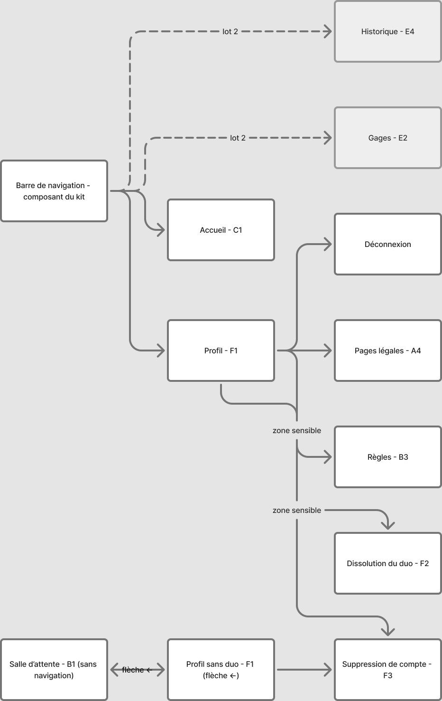

# Projet _Quest & Love_

> **Statut : rédigée, en attente de validation orale S4.** Contenu adapté du cadrage unifié et des documents de recherche/conception ; reste à insérer les maquettes une fois les wireframes réexportés (§ Maquettes et écrans) et à compléter deux sections différées : catégories de défis (S5) et textes d'interface définitifs (S6), toutes deux signalées par `⚠` à l'endroit concerné.
> Référence : cadrage unifié V2.9 (18/09/2026) · inventaire des écrans v2.2. En cas d'écart, le cadrage fait foi.

## Description synthétique

Auteurs : Sheyrel, Matteo

Pitch :

> **Quest & Love** transforme le quotidien d'un couple en jeu.
>
> Chaque matin, trois défis tirés au sort. Chacun en choisit un — pas pour soi, pour l'autre. À midi, les deux défis se révèlent en même temps. Il reste jusqu'à minuit pour les relever.
>
> Un défi non relevé coûte un point de vie. À court de points, c'est le partenaire qui rédige le gage.
>
> Drôle, quotidien, jamais intime. Un duo fermé, pas de conversation, pas de score : juste ce qu'il faut de hasard pour n'avoir rien à négocier.

Application : `https://azrael.sha.univ-poitiers.fr/~mlorenzi/`

Code source : `https://azrael.sha.univ-poitiers.fr/~mlorenzi/debug.php`

## Principales caractéristiques

### _Minimum viable product_{lang=en} (MVP)

- Compte et duo
  - Inscription par pseudo et mot de passe, sans adresse électronique
  - Appairage par code d'invitation (60 minutes, usage unique, régénérable)
- Journée de jeu
  - Participation quotidienne (« On joue aujourd'hui ? »)
  - Tirage de 3 défis en éventail, choix et attribution au partenaire
  - Révélation, défi aléatoire à 12 h
  - Déclaration « défi réalisé »
- Conséquences
  - Expiration à minuit, perte d'1 PV
  - 0 PV : retour à 5 PV (lot 1)
- Gestion du compte
  - Profil, dissolution du duo, suppression de compte
  - Pages légales

### Ce que l'application n'est pas

- **Pas une messagerie** : aucune conversation, aucune négociation dans l'outil.
- **Pas une application de développement personnel** : ni objectifs, ni progression, ni bien-être.
- **Pas un tracker d'habitudes** : le défi est ponctuel, non répété, non mesuré dans la durée.
- **Pas une application intime** : registre exclu de la V1.
- **Pas un réseau social** : aucun partage, aucun contenu public, un duo fermé.

### Profils utilisateurs

> Détail complet : [`proto-personas.md`](../02-recherche-utilisateur/proto-personas.md). Personas à confirmer par la recherche utilisateur.

- **Joueur initiateur** : crée le compte et partage le code (persona Sylvianne, 26 ans, en couple depuis 3 ans, très à l'aise mobile). Ouvre l'application en tout début ou toute fin de journée, choisit son défi vite, sur un coup de tête. Cherche à casser la routine du quotidien sans « grande discussion » à avoir, redoute un usage qui s'essouffle comme la plupart des apps de gamification. *« Je veux pas un truc qui me demande de "travailler ma relation", je veux juste un truc qui nous fait marrer ce soir. »*
- **Joueur invité** : rejoint via le code, profil plus sceptique (persona Joul, 31 ans, en couple depuis 8 mois). N'a pas cherché l'application lui-même, teste en observateur les premiers jours avant de s'investir, se méfie des mécaniques de gamification qu'il trouve parfois culpabilisantes. *« Tant que ça reste léger et que ça ne devient pas un devoir de plus, je suis partant. Mais à la première fois où ça me fait sentir en faute, je désinstalle. »*
- Rôles symétriques une fois le duo formé : chaque joueur est à la fois **émetteur** et **destinataire**.

### Scénario d'utilisation

1. Le joueur **initiateur** découvre l'application et crée un **compte**
2. Il obtient un **code d'invitation** et le partage à son partenaire
3. Le **partenaire** crée un compte (ou se connecte) et saisit le code : le **duo** est formé
4. Les deux joueurs découvrent les **règles** (onboarding)
5. Chaque jour, entre 00 h et 12 h :
    - chacun répond à « On joue aujourd'hui ? »
    - si les deux répondent oui, chacun **pioche** parmi 3 défis et en **attribue** un à l'autre
6. Le **défi** est révélé à son destinataire (les deux ont choisi, ou 12 h)
7. Le destinataire réalise le défi et le **déclare réalisé** avant minuit
8. À minuit, un défi non réalisé **expire** et coûte **1 PV**
9. (lot 2) L'émetteur peut **contester** ; à 0 PV, le partenaire rédige un **gage**
10. Un joueur peut à tout moment **dissoudre** le duo ou **supprimer** son compte

### Guide utilisateur : règles du jeu (trame)

- **Le duo** : formation d'un duo fermé par code d'invitation, un seul duo actif par joueur à la fois.
  - Formation par code, un seul duo par joueur
  - Duo formé après 12 h : premier jour de jeu le lendemain
- **La participation quotidienne** : à la première connexion du jour, chaque joueur répond à « On joue aujourd'hui ? » ; la journée n'est jouée que si les deux répondent oui.
  - Question posée entre 00 h et 12 h, réponse définitive
  - Journée blanche : « non », absence de réponse, partenaire ayant déjà dit non
- **Le tirage et le choix** : chaque joueur pioche 3 défis et en attribue un seul à son partenaire, avant midi.
  - 3 défis, un seul attribué, choix définitif avant 12 h
  - Défi aléatoire : joueur passif privé de son choix
- **La révélation** : le défi attribué devient visible pour son destinataire dès que les deux joueurs ont choisi, ou à midi au plus tard.
- **La réalisation du défi** : le destinataire déclare son défi réalisé sur l'honneur, sans preuve à fournir.
  - Déclaration sur l'honneur, sans preuve, sans annulation
  - Échéance : minuit, heure de Paris
- **Les points de vie** : chaque joueur démarre à 5 points de vie ; un défi non réalisé avant minuit en coûte 1 (2 en lot 2 si un gage est déjà en attente) ; à 0 point de vie, le compteur remonte immédiatement à 5 (lot 1) ou déclenche un gage (lot 2).
- **Les gages** _(lot 2)_ : à 0 point de vie, le partenaire est invité à rédiger un gage libre ; tant qu'un gage est en attente, la perte de points de vie double (plafonnée à 2) ; pas d'échéance sur un gage.
- **La contestation** _(lot 2)_ : l'émetteur d'un défi dispose de 24 h après validation pour le contester, via un lien discret visible de lui seul ; passé ce délai, le défi est définitivement acquis.
- **Quitter le duo, supprimer son compte** : dissolution du duo possible à tout moment (données de jeu du duo supprimées, comptes conservés et réappairables) ; suppression de compte, qui entraîne la dissolution du duo si celui-ci existe encore.
- **Mot de passe oublié = compte perdu** : aucune adresse électronique n'est demandée ; un mot de passe oublié rend le compte définitivement inaccessible, un avertissement est affiché à l'inscription.

## Documentation détaillée des règles

### Modèle temporel

- **Trois bornes**, en heure de Paris, calculées côté serveur uniquement : **00 h** (ouverture de la journée, début de la participation), **12 h** (bascule : fin des choix, révélation), **minuit** (expiration des défis non réalisés).
- **Tableau des cas de participation et de choix** (cadrage § 4.2) :

  | Réponses | Choix à 12 h | Résultat |
  |---|---|---|
  | Oui / Oui | Les deux | Journée normale |
  | Oui / Oui | Un seul | Le joueur diligent reçoit un défi aléatoire |
  | Oui / Oui | Aucun | Deux défis aléatoires |
  | Oui / Non | — | Journée blanche |
  | Absence de réponse | — | Journée blanche |

- **Choix assumé de la bascule à 12 h** : la persona principale ouvre l'application en tout début ou toute fin de journée. Un couple qui ne se connecte que le soir ne peut pas jouer : la journée est blanche. Ce choix délibéré garantit une demi-journée pour réaliser le défi et une révélation commune, sans tâche planifiée ; il sera observé avec le couple témoin et analysé en recul réflexif.
- **Calculs paresseux au chargement de page** : en l'absence de tâche planifiée sur l'hébergement, l'expiration, la révélation et l'attribution des défis aléatoires ne sont pas calculées à heure fixe mais à chaque chargement de page, en rattrapant tout ce qui aurait dû se produire depuis la dernière visite. Détail du mécanisme : [`doc-technique.md`](../04-technique/doc-technique.md) § 3.2.

### Points de vie

| Événement | Effet | Lot |
|---|---|---|
| Départ | 5 PV | 1 |
| Défi non réalisé avant minuit | −1 PV | 1 |
| Défi non réalisé, gage en attente | −2 PV | 2 |
| Défi contesté | −1 PV (−2 si gage en attente) | 2 |
| Journée blanche | Aucun effet | 1 |
| 0 PV | Lot 1 : retour à 5 · lot 2 : gage | 1 / 2 |

- **Explications et exemples** : chaque joueur démarre avec 5 points de vie, affichés en continu sur l'accueil face-à-face. Une journée blanche (aucune réponse ou réponse négative d'un des deux joueurs) n'a aucun effet sur les points de vie : seul un défi effectivement attribué et non réalisé en coûte un. En lot 2, tant qu'un gage est en attente, chaque défi non réalisé ou contesté coûte 2 points de vie au lieu d'1, jusqu'à ce que la liste des gages en attente soit vide.

### Gages _(lot 2)_

- **Déclenchement et rédaction** : quand un joueur atteint 0 point de vie, ses points de vie remontent immédiatement à 5 et son partenaire est invité à rédiger un gage libre — proposition prioritaire à la connexion, mais non bloquante.
- **Statut « en attente » et pénalité doublée** : le gage est « en attente » dès sa rédaction. Tant qu'au moins un gage est en attente, tout défi non réalisé ou contesté coûte 2 points de vie au lieu d'1 (plafond de 2, quel que soit le nombre de gages en attente).
- **Réalisation, contestation unique** : le joueur concerné marque le gage réalisé. Le gage peut être contesté une seule fois : il repasse alors en attente, sans perte de points de vie supplémentaire ; la déclaration suivante est définitive.
- **Absence d'échéance** : contrairement à un défi, un gage n'a pas de date limite — risque accepté et documenté en recul réflexif.

### Bibliothèque et tirage

- **Volume et catégories** : environ 50 défis pour la V1, répartis en 4 à 5 catégories. `⚠ Catégories encore provisoires — à figer en S5, une fois les 15 premiers défis rédigés et regroupés ; section à mettre à jour à cette échéance.`
- **Règles de tirage** : les 3 propositions du jour sont tirées parmi les défis jamais reçus par le destinataire, sans doublon entre elles ; seul le défi effectivement attribué (choisi ou aléatoire) est exclu par la suite, et une proposition non choisie n'est pas reproposée pendant 3 jours. Quand le réservoir d'un destinataire descend sous 3 défis, son cycle repart à zéro.
- **Tirage persistant** : les 3 propositions du jour sont enregistrées dès leur première apparition et ne changent plus ensuite — un rechargement de page ne permet pas de « retirer » pour obtenir un défi plus facile.
- **Contrainte de point de vue et registre des défis** : chaque défi est écrit du point de vue de celui qui le reçoit, jamais de celui qui le choisit — un défi tiré est toujours attribué à l'autre. Registre : drôle, original, ancré dans le quotidien du couple, réalisable en une journée, sans dépense ni contenu intime.

### Cycle de vie d'une mission

- **Statuts** : un défi attribué (appelé « mission ») passe par les états `attribue_non_revele`, `en_cours`, `valide`, puis `acquis` une fois la fenêtre de contestation passée ; il peut aussi passer à `expire` (non réalisé à minuit) ou, en lot 2, à `conteste`.
- **Diagramme des transitions et détail des déclencheurs** : annexe [`modele-donnees.md`](../04-technique/modele-donnees.md) § 3, pour éviter de recopier un schéma qui divergerait sinon de sa source.
- **Origine** : une mission naît soit d'un **choix** du joueur (`choix`), soit d'une **attribution aléatoire** à midi si le joueur passif n'a pas choisi (`aleatoire`) — dans les deux cas, le défi reçu est un défi normal, seul son origine diffère.

### Code d'invitation

- **Validité 60 minutes, usage unique, régénération** : le code affiché en salle d'attente est valable 60 minutes. Il peut être régénéré à tout moment par un lien discret « nouveau code », ce qui invalide immédiatement l'ancien.
- **Cas d'erreur** : un joueur peut se tromper en saisissant son propre code, saisir un code expiré ou déjà régénéré, ou enchaîner trop de tentatives (au-delà de 5, un délai s'applique avant de pouvoir réessayer).
- **Lien d'invitation reçu** : selon la situation du joueur qui ouvre le lien, l'application aiguille différemment — connecté et déjà en duo : rappel du duo actuel et proposition de le quitter pour en rejoindre un autre ; connecté sans duo ou non connecté : arrivée en salle d'attente ou en inscription/connexion avec le code prérempli, conservé même le temps de créer un compte.

### Sécurité et limites fonctionnelles visibles

- **Limite de 5 tentatives** : au-delà de 5 essais infructueux sur la connexion ou la saisie d'un code d'invitation, un délai s'applique avant de pouvoir réessayer — visible du joueur comme un message d'attente, pas comme un blocage définitif.
- **Sessions multiples, double envoi** : un même compte ouvert sur deux appareils est un usage normal (c'est le scénario de la démonstration). Répondre deux fois à la même question ou valider deux fois le même défi depuis deux appareils n'a pas d'effet double : la première réponse enregistrée fait foi, l'affichage se corrige au rechargement sur l'autre appareil.

## Description fonctionnelle

### Principes d'interface

- **Mobile d'abord, desktop en adaptation** : les maquettes sont produites en priorité au format mobile ; l'affichage bureau en est une adaptation, pas un point de départ.
- **Une action principale par écran, cibles de 44 × 44 px** : chaque écran met en avant une seule action principale ; toute zone interactive (bouton, lien, pictogramme) reçoit une surface tactile d'au moins 44 × 44 px, sans exception.
- **Confirmations en panneau bas ; exceptions F2 et F3** : les confirmations (dont la déclaration « défi réalisé » depuis l'accueil) se font par un panneau bas générique. Exception : la dissolution du duo (F2) et la suppression de compte (F3) ont chacune un écran dédié, avec avertissement d'irréversibilité, exigé par le cadrage § 10.
- **Navigation** : barre basse à quatre onglets (Accueil, Gages, Historique, Profil), masquée sur les sous-écrans focalisés (ex. tirage, défi reçu) et sur les écrans d'événement.
- **Voix de maître du jeu, tutoiement** : tutoiement intégral dans toute l'application, défis compris (pages légales exceptées, en tournures impersonnelles). L'application s'exprime avec une posture de maître du jeu qui annonce et dramatise légèrement, sans jamais dire « je » ni juger le joueur — l'humour vise la situation, jamais la personne. Exemple de référence : « Minuit a sonné. Le défi s'est envolé, et un cœur avec lui. » Détail complet : guide de style (à créer en S6, § « Textes d'interface » ci-dessous).
- **Accessibilité** : les points de vie ne reposent jamais sur la couleur seule (forme et texte les accompagnent) ; les animations respectent `prefers-reduced-motion` (ex. l'éventail de tirage s'affiche directement, sans animation) ; l'échéance avant minuit est toujours lisible en texte statique, même si un script l'enrichit. Niveau visé : WCAG 2.1 AA sur le périmètre du lot 1.

### Carte de navigation

Schéma des enchaînements entre écrans, à l'échelle de l'application. Détail par parcours : [`03-conception/parcours/`](../03-conception/parcours/) (arrivée et appairage, journée de jeu, fin de défi et événements).

### Maquettes et écrans

> Pour chaque écran : maquette, éléments affichés, actions possibles, destinations, cas d'erreur. Nomenclature identique à l'inventaire et au fichier Figma.
> Une variante notée en sous-point n'a pas de cadre dédié dans le Figma : elle est documentée en note sous le cadre concerné (§ 8.5 du cadrage). Son texte reste à rédiger comme celui d'un écran.
> **Maquettes** : les captures actuelles (`03-conception/wireframes/`) datent d'avant la reprise du zonage du 18/09 et doivent être réexportées sur les 27 cadres actuels (v2.2) avant insertion ici — chaque écran ci-dessous porte la mention `[maquette : à insérer après réexport]` en attendant. Le texte, lui, est déjà rédigé.

#### Bande 01 — Arrivée et appairage

- **A1 · Accueil public** `[maquette : à insérer après réexport]`
  Écran d'entrée non connecté : présente l'application (pitch, ton) et propose de créer un compte ou de se connecter.
  - Variante : invitation reçue (créer un compte / j'ai déjà un compte) — note sous le cadre A1, pas de cadre dédié
- **A2 · Inscription** `[maquette : à insérer après réexport]`
  Formulaire pseudo + mot de passe.
  - Avertissement mot de passe, mention CGU, code prérempli, erreurs
  - Destinations : B2 (code valide), B1 (sans code ou code invalide), retour A1
- **A3 · Connexion** `[maquette : à insérer après réexport]`
  Formulaire pseudo + mot de passe.
  - Erreurs, délai après 5 échecs, code conservé
  - Destinations : C1 (en duo), B2 (code valide), B1
- **A4 · Pages légales** (gabarit unique) `[maquette : à insérer après réexport]`
  Un seul gabarit, trois contenus sélectionnés par paramètre d'URL.
  - Mentions légales · Politique de confidentialité · Conditions d'utilisation
- **B1 · Salle d'attente** `[maquette : à insérer après réexport]`
  Affiche le code d'invitation à partager (valable 60 minutes) et un champ pour saisir un code reçu.
  - Code à partager, lien « nouveau code », saisie, erreurs, flèche ← vers F1
  - Cas : déjà en duo (rappel du duo, retour C1, quitter mon duo → F2)
- **B2 · Duo formé et onboarding** `[maquette : à insérer après réexport]`
  Présente les règles du jeu une par une, à la formation du duo.
  - Une règle par écran, bouton « Passer »
- **B3 · Règles du jeu** `[maquette : à insérer après réexport]`
  Rappel des règles du jeu, accessible à tout moment depuis le profil (F1), hors du parcours d'onboarding.

#### Bande 02 — Journée de jeu

- **C1 · Accueil face-à-face** : structure commune `[maquette : à insérer après réexport]`
  Socle partagé par tous les états de l'accueil : deux colonnes symétriques (une par joueur) et une zone d'action pleine largeur en dessous. Pas de cadrage « versus » : aucun score, aucun signe de rivalité.
  - Colonnes des deux joueurs (avatar, pseudo, jauge PV, état du jour)
  - Élément commun, zone d'action pleine largeur
- **C1 · États de l'accueil** `[maquettes : à insérer après réexport]`
  Le même socle affiche un des six états selon l'avancement de la journée, plus le cas « aucun jeu aujourd'hui » :
  - État 1 : on joue aujourd'hui ?
    - Variante : confirmation « pas aujourd'hui » (panneau bas, erreur hors délai)
  - État 2 : attente du partenaire
  - État 3 : à toi de piocher
  - État 4 : défi envoyé, en attente de révélation
  - État 5 : révélation
  - État 6 : défi reçu en cours
    - Variante : défi réalisé, statut du défi envoyé (ex-état 7, même cadre que l'état 6)
  - Cas : aucun jeu aujourd'hui
    - Journée blanche (3 variantes de texte)
    - Variante : premier jour de jeu demain
- **C2 · Tirage** `[maquette : à insérer après réexport]`
  Présente les 3 défis piochés en éventail, face cachée.
  - Éventail de 3 cartes
  - Carte piochée, remplacement par une autre carte, « Attribuer »
- **C3 · Défi reçu** `[maquette : à insérer après réexport]`
  Affiche le défi reçu et son état.
  - En cours · confirmation « réalisé » · réalisé (un seul cadre, les deux derniers états en variantes ; confirmation par le panneau bas partagé)
  - Sans navigation, sans mention de contestabilité
- **D2 · Événement : le hasard a choisi pour toi** `[maquette : à insérer après réexport]`
  Écran d'événement annonçant qu'un défi a été attribué au hasard, faute de choix avant midi.

#### Bande 03 — Fin de défi et événements

- **D1 · Défi expiré, −1 PV** `[maquette : à insérer après réexport]`
  Écran d'événement affiché au premier chargement de page après minuit, si un défi n'a pas été réalisé.
  - Variante « jamais découvert »
- **D5 · 0 PV, retour à 5** `[maquette : à insérer après réexport]`
  Écran d'événement affiché quand les points de vie atteignent 0 : annonce le retour immédiat à 5 (lot 1) ou le déclenchement d'un gage (lot 2).
- **D3 · Duo dissous** (vu par le partenaire) `[maquette : à insérer après réexport]`
  Écran d'événement informant le partenaire que l'autre joueur a dissous le duo ; redirige ensuite vers la salle d'attente.
- **Ordre d'enchaînement des écrans d'événement** : quand plusieurs événements se sont produits depuis la dernière visite, ils s'affichent un par un, dans cet ordre : duo dissous, expiration, passage à zéro, défi aléatoire (cadrage § 6.1, détail : [`doc-technique.md`](../04-technique/doc-technique.md) § 3.2).

#### Bande 04 — Profil, duo et système

- **F1 · Profil** `[maquette : à insérer après réexport]`
  Regroupe pseudo, partenaire, accès aux règles et pages légales, déconnexion et suppression de compte.
  - Cas : sans duo (accès depuis B1, sans partenaire ni option de dissolution, flèche ← vers B1)
- **F2 · Dissolution du duo** `[maquette : à insérer après réexport]`
  Écran dédié, exigé par le cadrage (§ 10) en exception à la règle générale du panneau bas de confirmation.
  - Avertissement d'irréversibilité, données supprimées
- **F3 · Suppression de compte** `[maquette : à insérer après réexport]`
  Écran dédié, même exception que F2 ; confirmation sans ressaisie du mot de passe.
- **G1 · Écrans d'erreur — page introuvable** `[maquette : à insérer après réexport]`
  Gabarit d'erreur générique.
- **G2 · Erreur serveur / action impossible** — variante de G1, même gabarit : note sous le cadre G1, pas de cadre dédié.

#### Bande 05 — Gamification _(lot 2, à zoner)_

- **C3+** · Défi envoyé réalisé : contester `[à zoner]`
- **D1+** · Défi expiré, −2 PV `[à zoner]`
- **D4** · Défi contesté, perte de PV `[à zoner]`
- **D5+** · 0 PV : gage déclenché `[à zoner]`
- **D6** · Partenaire : rédige le gage `[à zoner]`
- **D7** · Gage contesté, retour en attente `[à zoner]`
- **E1** · Rédaction d'un gage `[à zoner]`
- **E2** · Liste des gages en attente `[à zoner]`
- **E3** · Détail d'un gage `[à zoner]`
- **E4** · Historique `[à zoner]`

### Textes d'interface

`⚠ Section différée à S6 — rédaction définitive des textes d'interface pendant l'intégration HTML/CSS, en remplacement des textes d'attente (cadrage § 8.3). Ne pas improviser ces textes dans le code entre-temps.`

- Renvoi vers le guide de style (à créer en S6, à partir de cadrage § 8.1, § 8.2 : tutoiement, voix de maître du jeu, pas de « je », ne juge jamais le joueur)
- Liste des messages par écran, une fois rédigés — écrans concernés déjà listés en cadrage § 8.3

### Données personnelles côté utilisateur

- **Données collectées** : un pseudonyme et une empreinte de mot de passe, rien d'autre — ni nom, ni date de naissance, ni adresse électronique, ni géolocalisation. Aucune adresse électronique n'étant demandée, un mot de passe oublié rend le compte définitivement perdu (avertissement affiché à l'inscription).
- **Contenus libres non modérés** : les gages sont rédigés librement par les joueurs, sans modération ni signalement — acceptable dans un duo fermé et consenti, mais rappelé dans les conditions d'utilisation.
- **Effets de la dissolution et de la suppression** : dissoudre le duo supprime définitivement et immédiatement les missions, tirages, participations et gages du duo, sans corbeille ; les deux comptes sont conservés et réappairables, le partenaire étant informé à sa prochaine connexion. Supprimer son compte entraîne en plus la dissolution du duo s'il existe, puis la suppression du compte lui-même. Un écran de confirmation explicite précède les deux actions.

### Lots

#### Lot 1 : duo et défi du jour

- Inscription, connexion, appairage par code
- Participation quotidienne, tirage en éventail, choix et attribution
- Révélation, défi aléatoire, validation
- Expiration automatique, compteur de PV, perte d'1 PV
- Accueil face-à-face
- Dissolution du duo, suppression de compte
- Pages légales

#### Lot 2 : gamification

- Contestation
- Gages : déclenchement, rédaction, liste, contestation
- Pénalité doublée
- Historique

#### Lot 3 : confort

- Catégories et filtres
- Statistiques du couple
- Changement de mot de passe et de pseudo
- Avatars graphiques, finition graphique
- Notification par courriel (si faisable sur Azrael)

#### Lot 4 : perspectives (non développé)

- Défis personnalisés (humain ou IA)
- Preuve photo / vidéo
- Web push (PWA)
- Récupération de compte
- Punition alternative du joueur passif

## Idées pour la suite

- **Notifications** : trois niveaux envisagés — révélation à la connexion avec indicateur visuel non ambigu dès l'accueil (retenu, lot 1) ; courriel déclenché au choix, si l'envoi est possible sur Azrael (envisageable, lot 3) ; web push via PWA et service worker (documenté pour montrer la limite comprise, lot 4). `⚠ Le positionnement exact (arbitrage A3, cadrage § 6.5) reste ouvert, échéance S3 — à confirmer ici une fois tranché.`
- **Risques acceptés à observer** : un joueur en dette de gage peut répondre « non » chaque jour pour éviter la pénalité doublée ; un gage n'a pas d'échéance ; un couple qui ne se connecte que le soir subit des journées blanches répétées (conséquence assumée de la bascule à 12 h). Les trois sont des risques acceptés, à observer avec le couple témoin et à analyser en recul réflexif plutôt qu'à corriger maintenant.
- **Hypothèses à valider avec le couple témoin** (recruté en S9, testé en S11 ou S12) :
  - 3 défis : choix sans paralysie
  - Perte de PV et gage perçus comme ludiques, non punitifs
- **Défis personnalisés** : qui les écrit — un humain ou une IA ? Question ouverte, hors périmètre de la V1, à nourrir en perspective (lot 4).
