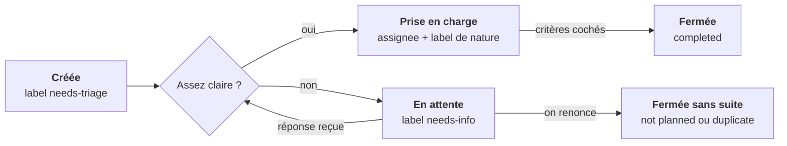

# Guide GitHub Issues

Une issue est un ticket : une tâche, un bug ou une question, suivi de son ouverture à sa fermeture. Ce guide montre comment s'en servir sur le dépôt `matteo-lorenzi/Quest-Love`, onglet **Issues**.

## Sommaire

1. [Vocabulaire](#vocabulaire)
2. [Le cycle de vie d'une issue](#le-cycle-de-vie-dune-issue)
3. [Créer une issue](#créer-une-issue)
4. [Trier avec les labels](#trier-avec-les-labels)
5. [Travailler sur une issue](#travailler-sur-une-issue)
6. [Découper et ordonner](#découper-et-ordonner)
7. [Fermer une issue](#fermer-une-issue)
8. [Antisèche](#antisèche)

## Vocabulaire

Huit mots suffisent pour suivre tout le reste.

| Mot | Ce que c'est | Où le voir |
| --- | --- | --- |
| Issue | Un ticket : une seule chose à faire, corriger ou trancher. Elle porte un numéro, par exemple `#12`. | Onglet **Issues** du dépôt |
| Label | Une étiquette de couleur qui classe l'issue (bug, documentation…). Une issue peut en avoir plusieurs. | Colonne de droite, **Labels** |
| Assignee | La personne responsable de l'issue. C'est elle qui la fait avancer. | Colonne de droite, **Assignees** |
| Commentaire | Un message sous l'issue : question, avancement, décision. Tout l'historique reste lisible. | Bas de l'issue |
| Mention | `@pseudo` dans un texte : la personne reçoit une notification. | Dans un commentaire |
| Référence | `#12` dans un texte ou un commit : lien cliquable vers l'issue 12. | Partout sur GitHub |
| Sous-issue | Une issue rattachée à une issue parente, pour découper un gros travail. | Bloc **Sub-issues** dans l'issue |
| Blocage | « Bloquée par #12 » : on ne peut pas commencer avant que #12 soit fermée. | Colonne de droite, **Relationships** |

## Le cycle de vie d'une issue

Une issue passe par le tri, puis se ferme faite ou abandonnée.



Toute issue neuve est relue par le binôme. S'il manque une information, elle attend la réponse de son auteur ; sinon quelqu'un la prend en charge jusqu'à sa fermeture.

## Créer une issue

Une bonne issue se comprend sans te poser de question. Compte deux minutes.

1. Ouvre le dépôt sur GitHub, onglet **Issues**, puis clique **New issue**.
2. Cherche d'abord dans la liste si le sujet existe déjà. Si oui, commente l'issue existante au lieu d'en créer une nouvelle.
3. Écris un **titre** court qui dit l'action : « Afficher le tirage de trois défis », pas « Tirage ».
4. Remplis la **description** avec le modèle ci-dessous.
5. Dans la colonne de droite, ajoute un ou plusieurs **labels** et, si tu sais qui s'en charge, un **assignee**.
6. Clique **Create**. L'issue reçoit son numéro, par exemple `#14`.

Modèle de description, à copier-coller. La description accepte le Markdown : les cases `- [ ]` deviennent cliquables.

```markdown
## Contexte
Pourquoi on en a besoin, en deux ou trois phrases.
Référence : cadrage § 4.2

## Ce qu'il faut faire
Le résultat attendu, vu par le joueur.

## Critères de fin
- [ ] Le tirage affiche trois défis différents
- [ ] Un seul choix possible par journée de jeu
- [ ] Testé sur mobile
```

Pour un bug, remplace « Ce qu'il faut faire » par trois lignes : ce que tu as fait, ce que tu attendais, ce qui s'est passé. Ajoute une capture d'écran : un glisser-déposer dans la description suffit.

## Trier avec les labels

Deux familles de labels : la **nature** de l'issue (une seule) et son **état de tri** (au plus un à la fois). Pour poser un label : colonne de droite, roue dentée à côté de **Labels**, puis coche.

| Label | Famille | Quand le poser |
| --- | --- | --- |
| `bug` | Nature | Quelque chose ne marche pas comme prévu |
| `enhancement` | Nature | Nouvelle fonctionnalité ou amélioration |
| `documentation` | Nature | Travail sur les documents (cadrage, doc technique…) |
| `accessibility` | Nature | Problème qui gêne une personne en situation de handicap |
| `question` | Nature | On a besoin d'une réponse, pas de code |
| `needs-triage` | Tri | Issue toute neuve, pas encore relue par le binôme |
| `needs-info` | Tri | Il manque une information : on attend la réponse de l'auteur |
| `duplicate` | Fermeture | Le sujet existe déjà dans une autre issue |
| `wontfix` | Fermeture | On a décidé de ne pas le faire |

Quand l'état change, retire l'ancien label de tri avant de poser le nouveau. Une issue avec `needs-triage` et `needs-info` en même temps ne dit plus rien.

## Travailler sur une issue

Règle d'or : l'issue raconte le travail. Quelqu'un qui l'ouvre doit savoir où on en est sans te demander.

- **S'assigner avant de commencer.** Colonne de droite, **Assignees**, puis **assign yourself**. L'autre sait ainsi que le sujet est pris.
- **Commenter les étapes.** Une décision prise, un obstacle, une question : un commentaire court suffit. Pas besoin de commenter chaque petit pas.
- **Mentionner pour demander.** `@pseudo` envoie une notification. Utilise-la pour une question précise, pas pour informer.
- **Cocher les critères de fin** dans la description au fur et à mesure. La liste affiche la progression, par exemple 2 sur 3.
- **Lier ses commits.** Ajoute `#14` dans le message de commit : le commit apparaît dans l'historique de l'issue.

```
git commit -m "Ajoute la page de tirage (#14)"
```

Pour suivre toutes les issues sur lesquelles tu es mentionné ou assigné, ouvre l'icône cloche en haut à droite de GitHub : ce sont tes **notifications**.

## Découper et ordonner

Un gros travail devient une issue parente et plusieurs sous-issues. L'ordre entre elles se note avec des blocages.

**Créer une sous-issue.** Dans l'issue parente, sous la description, clique **Create sub-issue** pour en créer une nouvelle. Ou utilise la flèche à côté pour rattacher une issue existante. La parente affiche une barre de progression : 2 sur 5 fermées, par exemple.

**Noter un blocage.** Dans l'issue qui attend, colonne de droite, section **Relationships**, choisis **Mark as blocked by**, puis l'issue qui doit passer avant. Une icône « Blocked » s'affiche tant que l'issue bloquante reste ouverte.

Exemple fictif sur Quest-Love, avec une parente « Lot 1 » :

| Issue | Bloquée par |
| --- | --- |
| #21 Inscription et connexion | — |
| #22 Appairage du duo | #21 |
| #23 Tirage de trois défis | #22 |
| #24 Révélation de la mission à 12 h | #23 |

Comment lire ce tableau : on commence par #21, la seule qui n'attend rien. Une issue devient disponible quand toutes celles qui la bloquent sont fermées.

## Fermer une issue

Une issue se ferme quand ses critères de fin sont tous cochés, ou quand on décide d'abandonner. Deux façons de la fermer.

**Par un commit (recommandé).** Écris `Closes #14` dans le message. L'issue se ferme toute seule quand le commit arrive sur la branche `main`, et le lien entre le code et le ticket reste dans l'historique.

```
git commit -m "Ajoute la page de tirage" -m "Closes #14"
```

Les mots `close`, `closes`, `fix`, `fixes`, `resolve` et `resolves` marchent aussi. Si tu veux seulement citer l'issue sans la fermer, écris `#14` seul.

**À la main.** En bas de l'issue, clique la flèche à côté de **Close issue** et choisis le motif :

| Motif | Quand l'utiliser |
| --- | --- |
| Close as completed | Le travail est fait |
| Close as not planned | On renonce : hors périmètre, plus utile, `wontfix` |
| Close as duplicate | Le même sujet est suivi dans une autre issue |

Ajoute toujours un commentaire d'une ligne avant de fermer à la main : pourquoi, et où est le résultat. Une issue fermée par erreur se rouvre avec **Reopen issue**.

## Antisèche

La barre de recherche de l'onglet **Issues** accepte des filtres. On peut les combiner avec un espace.

| Je veux voir… | Je tape |
| --- | --- |
| Les issues ouvertes | `is:issue is:open` |
| Celles qui me sont assignées | `is:open assignee:@me` |
| Celles que personne n'a prises | `is:open no:assignee` |
| Les bugs ouverts | `is:open label:bug` |
| Celles à trier | `is:open label:needs-triage` |
| Celles que j'ai créées | `author:@me` |
| Celles où on m'a mentionné | `mentions:@me` |
| Celles fermées récemment | `is:closed sort:updated-desc` |

Dans un texte ou un commit :

| J'écris | Effet |
| --- | --- |
| `#14` | Lien vers l'issue 14, sans la fermer |
| `Closes #14` | Ferme l'issue 14 quand le commit arrive sur `main` |
| `@pseudo` | Notifie la personne |
| `- [ ] tâche` | Case à cocher |
